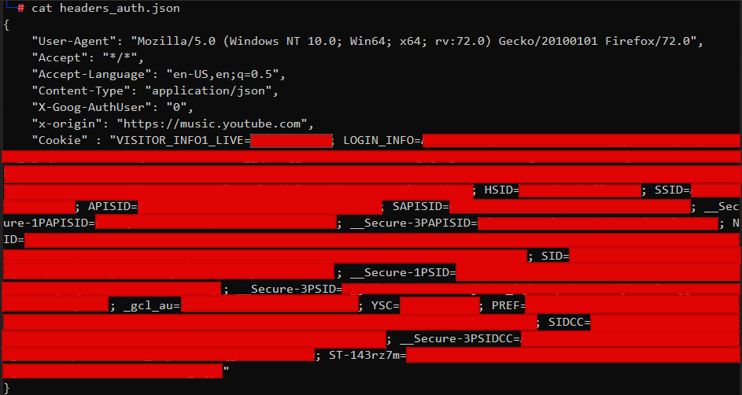

# sound-tunnel
Python script that transfers all Spotify playlists to Youtube-Music using [spotipy](https://github.com/plamere/spotipy) and [ytmusicapi](https://github.com/sigma67/ytmusicapi)

---
## Setup
### Spotify
1. Generate a new app at [https://developer.spotify.com/dashboard/applications)](https://developer.spotify.com/dashboard/applications)
2. Fill the `redirect_uri` from [config.py](./config.py) into the new app's settings
3. Fill in your `client_id` and `client_secret` from your Spotify app into [config.py](./config.py) file 

### YouTubeMusic
1. Open a new tab
2. Open the developer tools (Ctrl-Shift-I) and select the “Network” tab
3. Go to [https://music.youtube.com](https://music.youtube.com) and ensure you are logged in
4. Find an authenticated POST request. 
5. Paste copied cookies in [headers_auth.json](headers_auth.json). Should look something like this

### Run Command
1. After setting up both YouTubeMusic and Spotify. Transfer all your spotify playlists to youtubemusic with
`python3 main.py`
---
